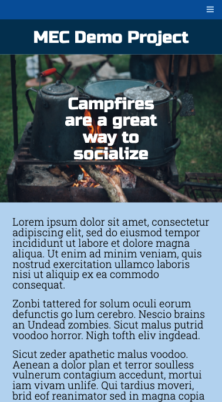

# MEC Final Project Demo

This project is a codealong demo for the August 2020 MEC Pre-Bootcamp. There are three pages, one of which is grabbing data from an API.

## Technologies used

- HTML
- CSS
- JavaScript
- [Pokéapi](https://pokeapi.co/): _source of Pokémon information_

## Contributors

- Shahid Sarker [shahidsarker](https://github.com/shahidsarker)

## Resources

- [Mastering Markdown](https://guides.github.com/features/mastering-markdown/)
- [PurpleBooth README Template](https://gist.github.com/PurpleBooth/109311bb0361f32d87a2)
- [Awesome README](https://github.com/matiassingers/awesome-readme)
